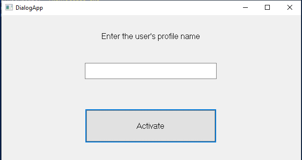
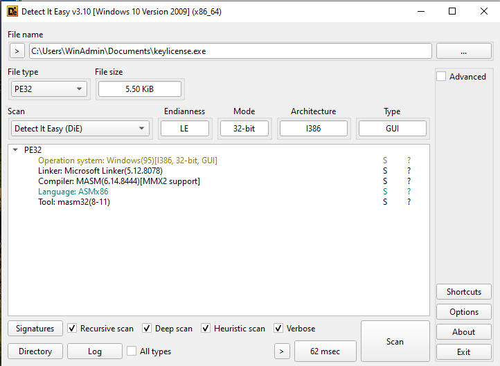
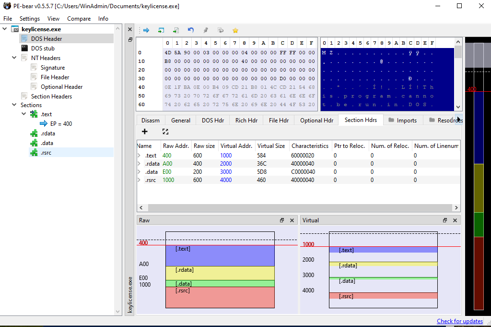
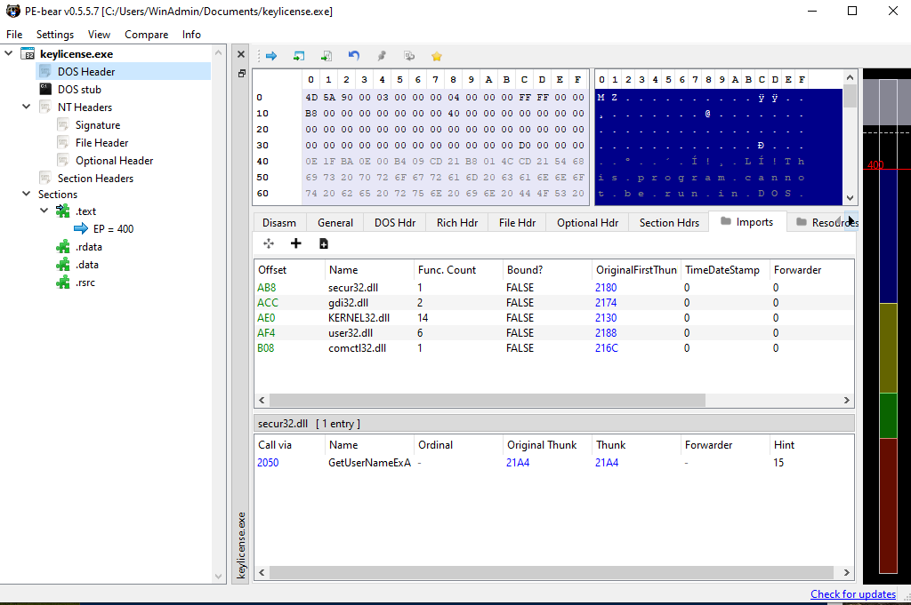
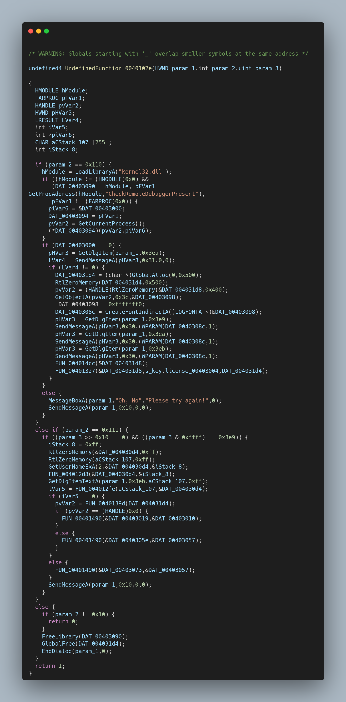

# Sallos's Key License – Crackme x86 (reverse + keygen)

Ce dépôt contient mon analyse et ma résolution du crackme **“Sallos's Key License”** (ASM x86, Windows).  
Objectifs pédagogiques :

- pratiquer le **reverse engineering sur binaire Win32 non packé** ;
- comprendre un flux **GUI / DialogBoxParamA / DialogProc** ;
- analyser une logique de **licence liée à l’utilisateur Windows** ;
- développer un **keygen** minimal pour générer un fichier `key.license` valide.

---

## 1. Contexte

- Source : crackmes.one (`Sallos's Key License`, ASM x86).
- Plateforme : Windows 10 64-bit en VM.
- Entrée utilisateur : un “user profile name” à saisir, puis clic sur **Activate**.



Comportement observé :

- si le nom d’utilisateur ne correspond pas au compte courant → `Invalid user login!` ;
- si le nom est correct mais pas de clé valide → `Invalid license key!`.

Ce lab est orienté **reverse & compréhension de logique de licence**, pas exploitation mémoire.

---

## 2. Outils & environnement

- VM Windows 10 (compte local non domaine).
- **Detect It Easy (DiE)** – détection PE / packer.
- **PE-bear** – inspection des headers, sections, imports.
- **Ghidra** – désassemblage et décompilation.
- **PowerShell** – génération du fichier `key.license`.

---

## 3. Reconnaissance statique rapide

### 3.1 Detect It Easy



Points clés :

- **PE32 / I386 / GUI** : exécutable 32-bit classique, interface graphique.
- **Language: ASM/x86, Compiler: MASM** : code assembleur écrit à la main, sans couche C.
- **Taille ~5.5 KiB** : code très court → peu de fonctions, logique compacte.
- **Pas de packer détecté** : binaire directement analysable (Ghidra, x32dbg, etc.).

### 3.2 PE-bear – sections & imports



- `.text` très petite → peu de logique.
- `.rdata` & `.rsrc` contiennent respectivement constantes/strings et ressources (dialog, manifest).



Imports intéressants :

- `USER32.dll` : `DialogBoxParamA`, `GetDlgItem`, `GetDlgItemTextA`, `MessageBoxA`…
- `SECUR32.dll` : `GetUserNameExA` → **récupération du nom d’utilisateur Windows**.
- `KERNEL32.dll` : `GetModuleFileNameA`, `CreateFileA`, `ReadFile`, `CheckRemoteDebuggerPresent`…
- `COMCTL32.dll` : `InitCommonControls` (GUI).
- `GDI32.dll` : `CreateFontIndirectA`, `GetObjectA` (police).

Ces imports suggèrent :

- un **dialogue Win32** piloté par `DialogBoxParamA` + callback `DialogProc` ;
- une vérification liée au **nom d’utilisateur** ;
- une **lecture de fichier** (probablement `key.license`) ;
- un petit **anti-debug** (`CheckRemoteDebuggerPresent`).

---

## 4. Analyse du flux d’exécution (reverse de la logique principale)

### 4.1. Point d’entrée

Le programme démarre via une fonction `entry()` minimale :

```c
HINSTANCE h = GetModuleHandleA(NULL);
InitCommonControls();

DialogBoxParamA(
    h,
    (LPCSTR)0x65,       // ID du dialogue
    NULL,
    (DLGPROC)&DialogProc,
    0
);

ExitProcess(0);
```

On comprend immédiatement que **toute la logique métier** réside dans la procédure de dialogue `DialogProc`.

---

### 4.2. Arrivée dans Ghidra : le code est illisible au départ

Lors du premier import, Ghidra identifie `LAB_0040102e` comme un *label*, et non une fonction :

* pas de signature,
* des variables anonymes (`param_1`, `param_2`, `param_3`, `local_107`, etc.),
* des sauts internes en cascade (`LAB_0040118f`, `LAB_00401280`…),
* aucun nom de fonction,
* toute la logique regroupée dans une seule zone de `.text`.

Voici un extrait brut de ce que Ghidra produit au départ :



C’est typiquement le cas avec un binaire **MASM** très compact.

---

### 4.3. Reconstruction manuelle de la signature

À partir de l’appel `DialogBoxParamA`, il a fallu **déduire manuellement** la signature correcte :

```c
INT_PTR CALLBACK DialogProc(HWND hDlg, UINT uMsg, WPARAM wParam, LPARAM lParam);
```

Donc dans Ghidra :

* `param_1` → `hDlg`
* `param_2` → `uMsg`
* `param_3` → `wParam_lParam` (à re-séparer en interne)

Cette étape permet ensuite :

* d’analyser proprement le flux ;
* de comprendre les trois messages clés :

  * **WM_INITDIALOG (0x110)**
  * **WM_COMMAND (0x111)**
  * **WM_CLOSE (0x10)**

---

### 4.4. Approche de reverse : suivre le flux et reconstruire chaque fonction

À partir de là, la démarche a consisté à :

1. **naviguer dans les blocs de contrôle** du DialogProc (`CMP`, `JNZ`, `JZ`, etc.) ;
2. **renommer les sous-fonctions** au fur et à mesure que leur rôle devenait clair ;
3. **réécrire un pseudocode propre** pour chaque routine (anti-debug, normalisation utilisateur, concaténation du chemin, lecture de fichier, validation…) ;
4. enfin, **cartographier le flux global** :

   * récupération du nom utilisateur,
   * génération du chemin vers `key.license`,
   * lecture du contenu,
   * passage du buffer dans un validateur,
   * affichage d’un message final.

Cette étape demande le plus de travail : toutes les fonctions MASM sont très compactes et ne ressemblent pas à des fonctions standard.

---

## 5. WM_INITDIALOG : anti-debug & préparation du chemin de licence

### 5.1 Anti-debug simple

```c
HMODULE hKernel = LoadLibraryA("kernel32.dll");
FARPROC pCheckDbg = GetProcAddress(hKernel, "CheckRemoteDebuggerPresent");

if (pCheckDbg != NULL) {
    BOOL isDebugged = FALSE;
    HANDLE hProc = GetCurrentProcess();
    ((BOOL (WINAPI *)(HANDLE, PBOOL))pCheckDbg)(hProc, &isDebugged);

    if (isDebugged) {
        MessageBoxA(hDlg, "Oh, No", "Please try again!", 0);
        SendMessageA(hDlg, WM_CLOSE, 0, 0);
        return TRUE;
    }
}
```

Si un debugger est détecté, le programme affiche un message d’erreur et ferme la fenêtre.

### 5.2 Mise en forme de la fenêtre & buffers

* allocation de `gLicensePathBuf` (`GlobalAlloc`, 0x500 bytes) ;
* `gWorkBuffer` initialisé à zéro (0x400 bytes) ;
* récupération de la police du contrôle, création d’une nouvelle `HFONT` et application aux contrôles `0x3e9`, `0x3ea`, `0x3eb` (cosmétique).

### 5.3 Construction du chemin vers `key.license`

Deux fonctions importantes :

```c
// 1) Construit le répertoire de l'exécutable courant dans outPath
void truncate_path(char *outPath)
{
    DWORD pathLen = GetModuleFileNameA(NULL, outPath, 0x80);
    char *p = outPath + (pathLen - 6);
    char *q;

    // recule jusqu'au dernier '\'
    do {
        q = p;
        p = q - 1;
    } while (*q != '\\');

    q[1] = '\0';  // garde "C:\...\dossier\"
}
```

```c
// 2) Concatène outBuf = outPath + "key.license"
int build_license_path(char *outPath, char *filename, char *outBuf)
{
    unsigned int dirLen = my_strlen(outPath);
    unsigned int fileLen = my_strlen(filename);
    int totalLen = 0;

    if (dirLen < 0x400 && fileLen < 0x100) {
        for (unsigned int i = 0; i < dirLen; i++)
            *outBuf++ = *outPath++;

        totalLen = dirLen + fileLen;

        for (unsigned int i = 0; i < fileLen; i++)
            *outBuf++ = *filename++;
    }
    return totalLen;
}
```

En pratique :

* `truncate_path(gWorkBuffer)` → produit `C:\...\Key License - Sallos\`
* `build_license_path(gWorkBuffer, "key.license", gLicensePathBuf)`
  → produit `C:\...\Key License - Sallos\key.license`

---

## 6. WM_COMMAND : vérification du nom d’utilisateur et de la licence

### 6.1 Vérification du nom d’utilisateur

Lorsque le bouton **Activate** (ID 0x3e9) est cliqué :

```c
int nameLen = 0xff;
char systemName[0xff];
char inputName[0xff];

RtlZeroMemory(systemName, 0xff);
RtlZeroMemory(inputName, 0xff);

// Récupère le nom de l'utilisateur courant au format DOMAIN\user
GetUserNameExA(2, systemName, &nameLen);

// Nettoie la partie domaine: "DOMAIN\user" → "user"
normalize_username(systemName, &nameLen);

// Récupère ce que l'utilisateur a tapé dans la textbox (0x3eb)
GetDlgItemTextA(hDlg, 0x3eb, inputName, 0xff);

// Compare input vs système
if (usernames_equal(inputName, systemName) != 0) {
    show_xor_message(gInvalidUserText, gCaption); // "Invalid user login!"
    SendMessageA(hDlg, WM_CLOSE, 0, 0);
    return TRUE;
}
```

Les fonctions associées :

```c
// "DOMAIN\\user" → "user"
void normalize_username(char *buf, int *pLen)
{
    char *scan = buf;
    while (*scan++ != '\\') { /* skip jusqu'au premier '\' */ }

    char *src = scan;
    int len = *pLen;
    while (len--) {
        *buf++ = *src++;
    }
}

// strcmp custom : 0 si égal, 1 sinon
int usernames_equal(char *input, char *expected)
{
    char c1, c2;
    do {
        c1 = *input;
        c2 = *expected++;
        if (c1 != c2) return 1;
        input++;
    } while (c1 != '\0');
    return 0;
}
```

Conclusion :
**Le programme n’accepte la clé que si le nom saisi = nom du compte Windows courant**.

### 6.2 Lecture et validation du fichier `key.license`

```c
int check_license_file(const char *licensePath)
{
    DWORD bytesRead;
    unsigned char buf[0x13];  // 19 octets
    HANDLE hFile = CreateFileA(
        licensePath,
        GENERIC_READ,
        FILE_SHARE_READ,
        NULL,
        OPEN_EXISTING,
        FILE_ATTRIBUTE_NORMAL,
        NULL
    );

    if (hFile == INVALID_HANDLE_VALUE)
        return 0;

    SetFilePointer(hFile, 0, NULL, FILE_BEGIN);
    ReadFile(hFile, buf, 0x13, &bytesRead, NULL);
    CloseHandle(hFile);

    if (bytesRead == 0x13) {
        return validate_license_bytes(buf);
    }
    return 2;  // format invalide
}
```

La fonction finale de validation :

```c
// Vérifie les 4 premiers octets de buf.
// Retourne 0 si OK, 1 sinon.
int validate_license_bytes(const unsigned char *buf)
{
    int rounds = 4;                    // 4 octets
    unsigned char divisor_prev = 2;    // 2
    unsigned char divisor_curr = 3;    // 3
    unsigned char prev_remainder = 0;

    while (rounds--) {
        unsigned short value = (prev_remainder << 8) | *buf;
        unsigned char remainder = (unsigned char)(value % divisor_prev);
        prev_remainder = remainder;

        if (remainder != 0) {
            return 1;                  // échec
        }

        unsigned char next = divisor_prev + divisor_curr; // 2,3,5,8,...
        buf++;
        divisor_prev = divisor_curr;
        divisor_curr = next;
    }
    return 0;                          // succès
}
```

Points importants :

* le programme exige que **19 octets** soient lus (0x13) ;
* seuls les **4 premiers octets** sont réellement testés ;
* les diviseurs successifs forment une suite type **Fibonacci** : `2, 3, 5, 8`.

Les conditions exactes deviennent :

| Octet | Diviseur | Condition     |
| ----- | -------- | ------------- |
| b0    | 2        | `b0 % 2 == 0` |
| b1    | 3        | `b1 % 3 == 0` |
| b2    | 5        | `b2 % 5 == 0` |
| b3    | 8        | `b3 % 8 == 0` |

Les 15 octets suivants peuvent être quelconques.

---

## 7. Construction d’une clé valide

### 7.1 Exemple de 4 premiers octets valides

Choix simple :

* `b0 = 0x2A` (42) → divisible par 2 ;
* `b1 = 0x3C` (60) → divisible par 3 ;
* `b2 = 0x28` (40) → divisible par 5 ;
* `b3 = 0x40` (64) → divisible par 8.

En hexadécimal :

```text
2A 3C 28 40
```

Il reste à compléter jusqu’à **19 octets** (par exemple avec des `0x00`).

### 7.2 Script de génération (`generate_key.py`)

```python
#!/usr/bin/env python3
"""
Keygen minimal pour le crackme 'Sallos's Key License'.

Génère un fichier 'key.license' de 19 octets :
- 4 premiers octets satisfont les conditions de validate_license_bytes()
- les 15 suivants sont remplis avec 0x00 (sans importance)
"""

from pathlib import Path

def build_key():
    # Octets choisis pour respecter les contraintes :
    # b0 % 2 == 0, b1 % 3 == 0, b2 % 5 == 0, b3 % 8 == 0
    first_bytes = [0x2A, 0x3C, 0x28, 0x40]

    # Compléter jusqu'à 19 octets
    padding = [0x00] * (0x13 - len(first_bytes))

    data = bytes(first_bytes + padding)
    out_path = Path("key.license")
    out_path.write_bytes(data)

    print(f"[+] key.license généré ({len(data)} octets)")
    print(f"    Premiers octets : {data[:4].hex(' ')}")

if __name__ == "__main__":
    build_key()
```

Usage :

```bash
python generate_key.py
```

Puis, dans le crackme :

1. placer `keylicense.exe` et `key.license` dans le même dossier ;
2. lancer le binaire ;
3. entrer **exactement** le nom du compte Windows courant (ex. `WinAdmin`) ;
4. cliquer sur **Activate** → la licence est acceptée.

---

## 8. Points techniques mis en avant

Ce challenge m’a permis de travailler les aspects suivants :

* **Analyse statique PE** : identification rapide du format, des sections et des imports (DiE, PE-bear).
* Compréhension d’une **boucle message-driven Win32** via `DialogBoxParamA` et `DialogProc`.
* Usage d’API **Windows sécurité** :

  * `GetUserNameExA` pour lier une clé à un utilisateur ;
  * `CheckRemoteDebuggerPresent` pour un anti-debug basique.
* Analyse de logique de licence :

  * construction du chemin vers un fichier de licence (`GetModuleFileNameA`, concaténation) ;
  * **contrôles arithmétiques simples** sur des octets (modulos successifs).
* Développement d’un **keygen Python** reproduisant la logique du binaire.

## 9. Sources & références

1. [Crackmes.one – Sallos's Key License](https://crackmes.one/crackme/5b9c3f1e3f6f4a001f1e8b8d)
2. [Microsoft Docs – DialogBoxParamA function](https://learn.microsoft.com/en-us/windows/win32/api/winuser/nf-winuser-dialogboxparama)
3. [Pinvoke.net – WM (Windows Messages)](https://www.pinvoke.net/default.aspx/Constants/WM.html)
---


